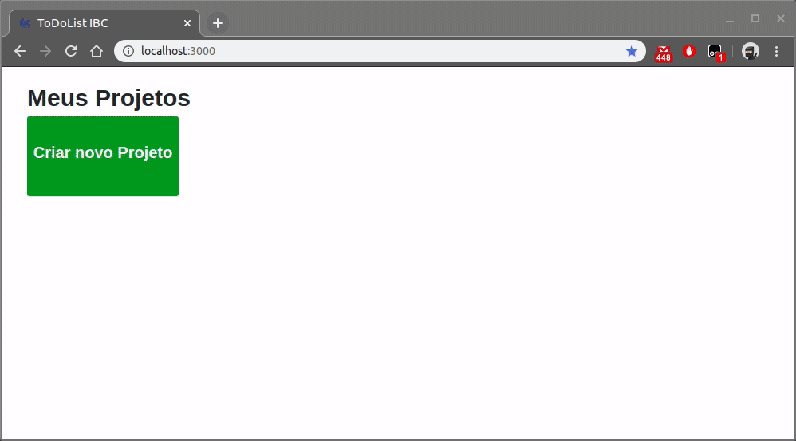

# ToDoList-IBC

## Preview


#### Characteristics
  - Boards ilimitados
  - Lists ilimitadas
  - Cards ilimitadas
 
#### Mandatory Technologies
  - Ruby On Rails
  - Bootstrap
  - rspec, faker, factory_bot_rails
  - RDS Aurora
  - Elastic Beanstalk
 
#### Prerequisites

* Ruby 2.6.5
* Bundler
* sqlite3
* mysql2

## Install

Clone the repository for your environment
```
$ git clone https://github.com/Braullio/todo_list_ibc.git
```

Go to the todo_list_ibc directory and run the bundler to install the project dependencies
```
$ cd todo_list_ibc
$ bundle install
```

Creating database for using project.
```
$ rails db:create db:migrate
```

Now just start the development server and access it through the browser.
Default URL: http://localhost:3000
```
$ rails s
```

## Execute testings
  Tests were written for models, controllers and routes. In the project folder, you must execute the command below.
```
$ rails spec
```

## Heroku
  https://ibc-todolist.herokuapp.com/
  
